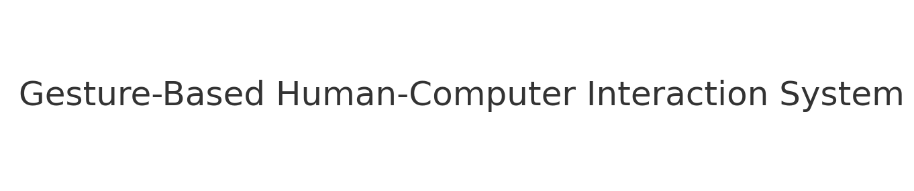
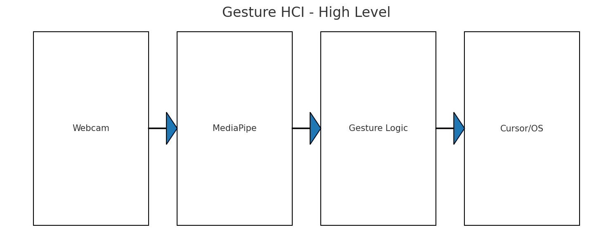
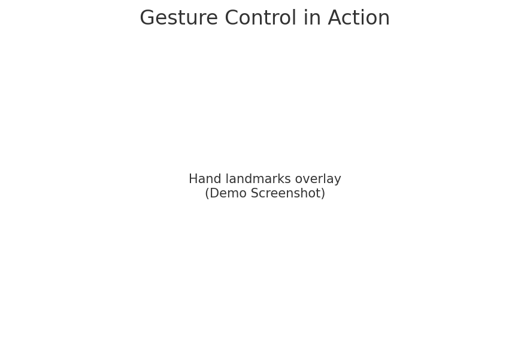

# Gesture-Based Human-Computer Interaction System

    

Control your computer using hand gestures via webcam. Includes a sentiment-aware chatbot demo.

> **Status:** Public, MIT-licensed, open to issues and PRs.

## ✨ Features
- Real-time processing
- Lightweight demo code that runs on most laptops
- Clean project structure
- Ready-to-use `requirements.txt`
- Screenshots and architecture diagram included

## 🧰 Tech Stack
- Python, OpenCV, NumPy
- MediaPipe, NLTK, scikit-learn

## 🚀 Quickstart
```bash
# 1) Create and activate a virtual environment
python -m venv .venv
# Windows:
.venv\Scripts\activate
# macOS/Linux:
source .venv/bin/activate

# 2) Install dependencies
pip install -r requirements.txt

# 3) Run the demo
python src/main.py
```

## 📦 Installation (Alt)
- You can skip heavy deps if you only want to see the windowed demo.
- For Twilio SMS, copy `src/config.example.toml` to `config.toml` and fill credentials. (Safeguard only)

## 🖼️ Screenshots




## 🗂️ Project Structure
```
.
├── assets/
│   ├── banner.png
│   ├── architecture.png
│   └── screenshot.png
├── src/
│   └── main.py
├── requirements.txt
├── LICENSE
├── .gitignore
└── README.md
```

## 🤝 Contributing
- Fork the repo and open a PR.
- Good first issues: docs improvements, performance tweaks, and cross-platform fixes.

## 📝 License
This project is released under the MIT License.
